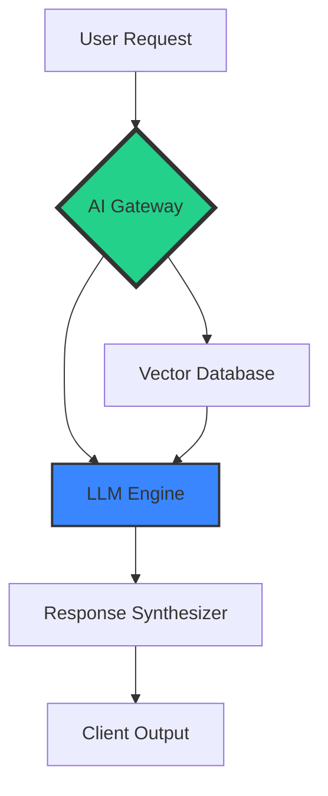

Modern AI architectures require a paradigm shift in how we handle data flow and model interaction.

## High-Level Workflow

The following diagram illustrates a standard AI-integrated system using our recommended patterns.

## Key Components

1. **AI Gateway**: Manages authentication, rate limiting, and model routing.
2. **Vector Database**: Provides long-term memory via embeddings.
3. **LLM Engine**: The core reasoning engine (e.g., GPT-4, Gemini).
